# 

  
<!-- Professional Animated Banner -->

<!-- Typing Animation for Role -->

---

## 🎯 About Me

**Software Development Engineer in Test** with proven expertise in designing and implementing comprehensive testing strategies across the full software development lifecycle. I specialize in building scalable automation frameworks that integrate seamlessly into CI/CD pipelines while maintaining excellence in manual testing methodologies.

My professional focus centers on **quality engineering**, where I combine technical precision with strategic thinking to deliver robust testing solutions. I excel at transforming complex testing requirements into automated, maintainable frameworks that empower development teams to deliver high-quality software consistently.

**Core competencies** include end-to-end test automation, API testing, performance validation, security assessment, and database verification. I am committed to establishing quality gates that prevent defects from reaching production while optimizing testing efficiency through intelligent automation strategies.

 

---

## 🛠️ Technical Expertise

### 📋 **Manual Testing**
<table>
  <tr>
    <td align="center" width="130">
      
       <b>Test Case Design</b>
    </td>
    <td align="center" width="130">
      
       <b>Defect Management</b>
    </td>
    <td align="center" width="130">
      
       <b>Exploratory Testing</b>
    </td>
    <td align="center" width="130">
      
       <b>Test Execution</b>
    </td>
  </tr>
</table>

### 🎯 **UI Automated Testing**
<table>
  <tr>
    <td align="center" width="130">
      
       <b>Selenium WebDriver</b>
    </td>
    <td align="center" width="130">
      
       <b>Pytest Framework</b>
    </td>
    <td align="center" width="130">
      
       <b>Page Object Model</b>
    </td>
  </tr>
</table>

### 🔌 **API Testing**
<table>
  <tr>
    <td align="center" width="130">
      
       <b>Postman</b>
    </td>
    <td align="center" width="130">
      
       <b>Python Requests</b>
    </td>
    <td align="center" width="130">
      
       <b>REST API Testing</b>
    </td>
  </tr>
</table>

### ⚡ **Performance Testing**
<table>
  <tr>
    <td align="center" width="130">
      
       <b>Locust</b>
    </td>
    <td align="center" width="130">
      
       <b>Load Testing</b>
    </td>
    <td align="center" width="130">
      
       <b>Stress Testing</b>
    </td>
  </tr>
</table>

### 🗄️ **Database Testing**
<table>
  <tr>
    <td align="center" width="130">
      
       <b>SQLite</b>
    </td>
    <td align="center" width="130">
      
       <b>SQLAlchemy ORM</b>
    </td>
    <td align="center" width="130">
      
       <b>Data Validation</b>
    </td>
  </tr>
</table>

### 🔐 **Security Testing**
<table>
  <tr>
    <td align="center" width="130">
      
       <b>OWASP ZAP</b>
    </td>
    <td align="center" width="130">
      
       <b>Vulnerability Scanning</b>
    </td>
    <td align="center" width="130">
      
       <b>API Security Testing</b>
    </td>
  </tr>
</table>

### 🔄 **CI/CD Integration**
<table>
  <tr>
    <td align="center" width="130">
      
       <b>Jenkins</b>
    </td>
    <td align="center" width="130">
      
       <b>GitHub Actions</b>
    </td>
    <td align="center" width="130">
      
       <b>Version Control</b>
    </td>
  </tr>
</table>

### 💻 **Programming Languages & Tools**
<table>
  <tr>
    <td align="center" width="110">
      
       <b>Python</b>
    </td>
    <td align="center" width="110">
      
       <b>HTML5</b>
    </td>
    <td align="center" width="110">
      
       <b>CSS3</b>
    </td>
    <td align="center" width="110">
      
       <b>JavaScript</b>
    </td>
    <td align="center" width="110">
      
       <b>Java</b>
    </td>
    <td align="center" width="110">
      
       <b>Chrome DevTools</b>
    </td>
  </tr>
</table>

---

## 🎯 Core Competencies

```mermaid
graph LR
    A[📋 Test Strategy] --> B[🎯 Framework Design]
    B --> C[🔄 Automation]
    C --> D[🔍 Quality Gates]
    D --> E[🚀 CI/CD Integration]
    E --> F[✅ Production Quality]
    
    style A fill:#3B4252,stroke:#5E81AC,stroke-width:2px,color:#D8DEE9
    style B fill:#434C5E,stroke:#5E81AC,stroke-width:2px,color:#D8DEE9
    style C fill:#3B4252,stroke:#5E81AC,stroke-width:2px,color:#D8DEE9
    style D fill:#434C5E,stroke:#5E81AC,stroke-width:2px,color:#D8DEE9
    style E fill:#3B4252,stroke:#5E81AC,stroke-width:2px,color:#D8DEE9
    style F fill:#434C5E,stroke:#5E81AC,stroke-width:2px,color:#D8DEE9
```

<table align="center">
<tr>
<td width="50%">

### 🚀 **Test Automation Excellence**
- Scalable UI & API automation frameworks
- Cross-browser testing implementation
- Data-driven testing methodologies
- Maintainable test architecture design

</td>
<td width="50%">

### 🔍 **Quality Engineering**
- Comprehensive test strategy development
- Risk-based testing approaches
- Continuous quality improvement
- Performance optimization techniques

</td>
</tr>
<tr>
<td>

### 🔄 **DevOps Integration**
- CI/CD pipeline integration
- Automated test reporting
- Quality metrics and KPIs
- Release readiness validation

</td>
<td>

### 👥 **Professional Impact**
- Cross-functional collaboration
- Technical mentoring and guidance
- Process improvement initiatives
- Quality culture establishment

</td>
</tr>
</table>

---

## 📂 Featured Testing Suites

<table>
<tr>
<td width="50%">

### 🎯 [UI Automation Framework](https://github.com/yourusername/selenium-automation-framework)

**Enterprise-grade UI automation framework**
- ✅ Page Object Model architecture
- ✅ Cross-browser compatibility
- ✅ Comprehensive reporting
- ✅ CI/CD pipeline integration

</td>
<td width="50%">

### 🔌 [API Testing Suite](https://github.com/yourusername/api-testing-comprehensive)

**Complete API validation framework**
- ✅ REST API endpoint testing
- ✅ Authentication & authorization
- ✅ Schema validation
- ✅ Performance monitoring

</td>
</tr>
<tr>
<td>

### ⚡ [Performance Testing Framework](https://github.com/yourusername/performance-testing-suite)

**Scalable load testing solution**
- ✅ Distributed load testing
- ✅ Real-time performance metrics
- ✅ Bottleneck identification
- ✅ Scalability assessment

</td>
<td>

### 🗄️ [Database Testing Suite](https://github.com/yourusername/database-testing-framework)

**Comprehensive database validation**
- ✅ Data integrity verification
- ✅ CRUD operations testing
- ✅ Performance optimization
- ✅ Migration validation

</td>
</tr>
<tr>
<td>

### 🔐 [Security Testing Toolkit](https://github.com/yourusername/security-testing-framework)

**Advanced security assessment suite**
- ✅ Vulnerability scanning
- ✅ Penetration testing automation
- ✅ Security compliance validation
- ✅ Risk assessment reporting

</td>
<td>

### 🔄 [CI/CD Integration Suite](https://github.com/yourusername/cicd-testing-pipeline)

**Complete DevOps testing integration**
- ✅ Automated test execution
- ✅ Quality gate enforcement
- ✅ Deployment validation
- ✅ Release management

</td>
</tr>
</table>

---

## 🌐 Professional Network

  

<!-- Professional separator -->

### 💡 Professional Philosophy

*"Excellence in software testing is not about finding defects—it's about preventing them through intelligent automation and strategic quality engineering."*

 

<!-- Enhanced visitor counter -->

---

  
<!-- Professional footer wave -->

