# 

  
<!-- Custom Animated Banner with Professional Colors -->

<!-- Enhanced Typing Animation -->

---

## 🚀 About Me

**Hey there! I'm Ibekwe Victor, a passionate Software Development Engineer in Test (SDET)** with a keen eye for detail and a mission to deliver flawless software experiences.

🎯 **My specialty lies in crafting robust test automation frameworks** that seamlessly integrate into CI/CD pipelines, combining the precision of automated testing with the intuition of manual exploration.

🔍 **What sets me apart:** I don't just find bugs—I prevent them. My approach involves building comprehensive testing strategies that cover every layer of the application stack, from UI interactions to database integrity.

⚡ **My passion:** Transforming complex testing challenges into elegant, automated solutions that empower teams to ship confidently and frequently.

🛡️ **Core philosophy:** Quality isn't just about finding defects; it's about building systems that make defects impossible.

 

---

## 🛠️ Tech Arsenal

### 📝 **Manual Testing**
<table>
  <tr>
    <td align="center" width="120">
      
       <b>Test Case Design</b>
    </td>
    <td align="center" width="120">
      
       <b>Bug Reporting</b>
    </td>
    <td align="center" width="120">
      
       <b>Exploratory Testing</b>
    </td>
    <td align="center" width="120">
      
       <b>Test Execution</b>
    </td>
  </tr>
</table>

### 🎯 **UI Automated Testing**
<table>
  <tr>
    <td align="center" width="120">
      
       <b>Selenium WebDriver</b>
    </td>
    <td align="center" width="120">
      
       <b>Pytest</b>
    </td>
    <td align="center" width="120">
      
       <b>Page Object Model</b>
    </td>
  </tr>
</table>

### 🔌 **API Testing**
<table>
  <tr>
    <td align="center" width="120">
      
       <b>Postman</b>
    </td>
    <td align="center" width="120">
      
       <b>Python Requests</b>
    </td>
    <td align="center" width="120">
      
       <b>REST API Testing</b>
    </td>
  </tr>
</table>

### ⚡ **Performance Testing**
<table>
  <tr>
    <td align="center" width="120">
      
       <b>Locust</b>
    </td>
    <td align="center" width="120">
      
       <b>Load Testing</b>
    </td>
    <td align="center" width="120">
      
       <b>Stress Testing</b>
    </td>
  </tr>
</table>

### 🗄️ **Database Testing**
<table>
  <tr>
    <td align="center" width="120">
      
       <b>SQLite</b>
    </td>
    <td align="center" width="120">
      
       <b>SQLAlchemy ORM</b>
    </td>
    <td align="center" width="120">
      
       <b>Data Validation</b>
    </td>
  </tr>
</table>

### 🔐 **Security Testing**
<table>
  <tr>
    <td align="center" width="120">
      
       <b>OWASP ZAP</b>
    </td>
    <td align="center" width="120">
      
       <b>Vulnerability Scanning</b>
    </td>
    <td align="center" width="120">
      
       <b>API Security Testing</b>
    </td>
  </tr>
</table>

### 🔄 **CI/CD**
<table>
  <tr>
    <td align="center" width="120">
      
       <b>Jenkins</b>
    </td>
    <td align="center" width="120">
      
       <b>GitHub Actions</b>
    </td>
    <td align="center" width="120">
      
       <b>Git</b>
    </td>
  </tr>
</table>

### 💻 **Programming Languages & Tools**
<table>
  <tr>
    <td align="center" width="100">
      
       <b>Python</b>
    </td>
    <td align="center" width="100">
      
       <b>HTML5</b>
    </td>
    <td align="center" width="100">
      
       <b>CSS3</b>
    </td>
    <td align="center" width="100">
      
       <b>JavaScript</b>
    </td>
    <td align="center" width="100">
      
       <b>Java</b>
    </td>
    <td align="center" width="100">
      
       <b>Chrome DevTools</b>
    </td>
  </tr>
</table>

---

## 🎯 What I Bring to the Table

```mermaid
graph LR
    A[🔧 Framework Design] --> B[📋 Test Strategy]
    B --> C[🚀 Automation]
    C --> D[🔍 Quality Assurance]
    D --> E[📊 Continuous Integration]
    E --> F[✅ Reliable Software]
    
    style A fill:#667eea
    style B fill:#764ba2
    style C fill:#667eea
    style D fill:#764ba2
    style E fill:#667eea
    style F fill:#764ba2
```

<table align="center">
<tr>
<td width="50%">

### 🚀 **Automation Excellence**
- Scalable UI & API test frameworks
- Page Object Model implementation
- Cross-browser testing strategies
- Data-driven testing approaches

</td>
<td width="50%">

### 🔍 **Quality Assurance**
- Functional & Regression testing
- Exploratory testing methodologies
- Security vulnerability assessment
- Performance & load testing

</td>
</tr>
<tr>
<td>

### 🔄 **CI/CD Integration**
- Jenkins pipeline automation
- GitHub Actions workflows
- Test reporting & analytics
- Continuous quality gates

</td>
<td>

### 👥 **Collaboration & Leadership**
- Cross-functional team collaboration
- Test strategy development
- Mentoring & knowledge sharing
- Quality metrics & KPIs

</td>
</tr>
</table>

---

## 📂 Featured Projects

<table>
<tr>
<td width="50%">

### 🎯 [Selenium Automation Framework](https://github.com/yourusername/selenium-framework)

**Key Features:**
- ✅ Page Object Model Design
- ✅ Cross-browser Support
- ✅ Detailed HTML Reports
- ✅ CI/CD Integration

</td>
<td width="50%">

### 🔌 [API Testing Suite](https://github.com/yourusername/api-testing-suite)

**Key Features:**
- ✅ REST API Validation
- ✅ Authentication Testing
- ✅ Data-driven Tests
- ✅ Response Validation

</td>
</tr>
<tr>
<td>

### ⚡ [Performance Testing Framework](https://github.com/yourusername/performance-testing)

**Key Features:**
- ✅ Distributed Load Testing
- ✅ Real-time Monitoring
- ✅ Performance Metrics
- ✅ Scalable Architecture

</td>
<td>

### 🗄️ [Database Testing Suite](https://github.com/yourusername/database-testing)

**Key Features:**
- ✅ Data Integrity Validation
- ✅ CRUD Operations Testing
- ✅ Database Schema Verification
- ✅ Transaction Testing

</td>
</tr>
<tr>
<td>

### 🔐 [Security Testing Toolkit](https://github.com/yourusername/security-testing)

**Key Features:**
- ✅ Vulnerability Scanning
- ✅ API Security Testing
- ✅ Automated Security Reports
- ✅ OWASP Top 10 Coverage

</td>
<td>

### 🔄 [CI/CD Test Integration](https://github.com/yourusername/cicd-testing)

**Key Features:**
- ✅ Automated Test Pipelines
- ✅ Multi-environment Testing
- ✅ Test Result Reporting
- ✅ Quality Gate Integration

</td>
</tr>
</table>

---

## 🌐 Let's Connect

  

<!-- Enhanced Animated separator -->

### 💭 Philosophy

*"Quality is not an accident; it is always the result of high intention, sincere effort, intelligent direction, and skillful execution."*

 

<!-- Visitor counter with updated count -->

---

  
<!-- Enhanced Footer wave with new color scheme -->

