# 
<div align="center">
  
<!-- Custom Animated Banner -->


<!-- Typing Animation for Role -->


</div>

---

## 🚀 About Me


```typescript
const ibekweVictor = {
    role: "Software Development Engineer in Test (SDET)",
    focus: ["Test Automation", "Quality Assurance", "API Testing"],
    mission: "Building reliable test frameworks & ensuring software excellence",
    philosophy: "Quality is not an act, it is a habit",
    currentlyWorking: "Scalable automation frameworks",
    funFact: "I find bugs before they find users! 🐛→🔍"
};
```

<br clear="right"/>

---

## 🛠️ Tech Arsenal

<div align="center">

### 🎯 **Automation & Testing**
<table>
  <tr>
    <td align="center" width="100">
      
      <br><sub><b>Selenium</b></sub>
    </td>
    <td align="center" width="100">
      
      <br><sub><b>Pytest</b></sub>
    </td>
    <td align="center" width="100">
      
      <br><sub><b>Python</b></sub>
    </td>
    <td align="center" width="100">
      
      <br><sub><b>Postman</b></sub>
    </td>
    <td align="center" width="100">
      
      <br><sub><b>Locust</b></sub>
    </td>
  </tr>
</table>

### 🔐 **Security & Performance**
<table>
  <tr>
    <td align="center" width="100">
      
      <br><sub><b>OWASP ZAP</b></sub>
    </td>
    <td align="center" width="100">
      
      <br><sub><b>API Security</b></sub>
    </td>
    <td align="center" width="100">
      
      <br><sub><b>SQLite</b></sub>
    </td>
    <td align="center" width="100">
      
      <br><sub><b>SQLAlchemy</b></sub>
    </td>
  </tr>
</table>

### ⚡ **CI/CD & DevOps**
<table>
  <tr>
    <td align="center" width="100">
      
      <br><sub><b>Jenkins</b></sub>
    </td>
    <td align="center" width="100">
      
      <br><sub><b>Git</b></sub>
    </td>
    <td align="center" width="100">
      
      <br><sub><b>GitHub Actions</b></sub>
    </td>
  </tr>
</table>

</div>

---

## 🎯 What I Bring to the Table

```mermaid
graph LR
    A[🔧 Framework Design] --> B[📋 Test Strategy]
    B --> C[🚀 Automation]
    C --> D[🔍 Quality Assurance]
    D --> E[📊 Continuous Integration]
    E --> F[✅ Reliable Software]
    
    style A fill:#667eea
    style B fill:#764ba2
    style C fill:#667eea
    style D fill:#764ba2
    style E fill:#667eea
    style F fill:#764ba2
```

<div align="center">



</div>

<table align="center">
<tr>
<td width="50%">

### 🚀 **Automation Excellence**
- Scalable UI & API test frameworks
- Page Object Model implementation
- Cross-browser testing strategies
- Data-driven testing approaches

</td>
<td width="50%">

### 🔍 **Quality Assurance**
- Functional & Regression testing
- Exploratory testing methodologies
- Security vulnerability assessment
- Performance & load testing

</td>
</tr>
<tr>
<td>

### 🔄 **CI/CD Integration**
- Jenkins pipeline automation
- GitHub Actions workflows
- Test reporting & analytics
- Continuous quality gates

</td>
<td>

### 👥 **Collaboration & Leadership**
- Cross-functional team collaboration
- Test strategy development
- Mentoring & knowledge sharing
- Quality metrics & KPIs

</td>
</tr>
</table>

---

## 📂 Featured Projects

<div align="center">

<table>
<tr>
<td width="50%">

### 🎯 [Selenium Automation Framework](https://github.com/yourusername/selenium-framework)


**Key Features:**
- ✅ Page Object Model Design
- ✅ Cross-browser Support
- ✅ Detailed Reporting
- ✅ CI/CD Integration

</td>
<td width="50%">

### 🔌 [API Testing Suite](https://github.com/yourusername/api-testing-suite)


**Key Features:**
- ✅ REST API Validation
- ✅ Authentication Testing
- ✅ Data-driven Tests
- ✅ Performance Monitoring

</td>
</tr>
<tr>
<td>

### ⚡ [Load Testing Framework](https://github.com/yourusername/load-testing)


**Key Features:**
- ✅ Distributed Load Testing
- ✅ Real-time Monitoring
- ✅ Performance Metrics
- ✅ Scalable Architecture

</td>
<td>

### 🔐 [Security Testing Toolkit](https://github.com/yourusername/security-testing)


**Key Features:**
- ✅ Vulnerability Scanning
- ✅ API Security Testing
- ✅ Automated Reports
- ✅ OWASP Compliance

</td>
</tr>
</table>

</div>

---

## 🌐 Let's Connect

<div align="center">

<a href="https://www.linkedin.com/in/ibekwe-victor-387214242/">
  
</a>
<a href="mailto:ibekwevictor204@gmail.com">
  
</a>
<a href="https://github.com/ibekwevictor">
  
</a>

<br><br>

<!-- Animated separator -->


### 💭 Philosophy

*"Quality is not an accident; it is always the result of high intention, sincere effort, intelligent direction, and skillful execution."*

<br>

<!-- Visitor counter -->


</div>

---

<div align="center">
  
<!-- Footer wave -->


</div>
